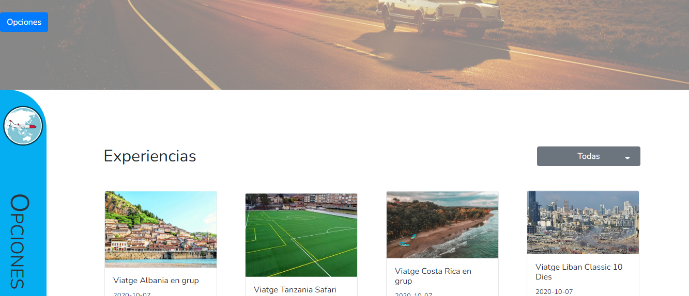

# CallejerosViajeros

Proyecto que trata de una pagina web para compartir, recomendar y valorar tus experiencias personales vividas al viajar por todo el mundo. 



### Instalación en local 🔧

- Clona el repositorio en tu maquina local
- Crea tu entorno para ejecutar PHP y utilizar una base de datos de mysql
- En el fichero database/DBAbstractModel.php,       modifica los siguientes campos para conectarte a la BD.

```
## Ruta de la base de datos
    private static $db_host = "localhost";
## Usuario de la base de datos
    private static $db_user = "root";
## Password de la base de datos
    private static $db_pass = "";
```

## Construido con 🛠️

- [JavaScript](https://www.javascript.com/) - Lenguaje de programacion
- [Php](https://www.php.net/) - Lenguaje de programacion
- [MySql](https://www.mysql.com/) - Base de datos

## Autor ✒️

**Rafael Garcia Perez** - [rafael3994](https://github.com/Rafael3994)

## Licencia 📄

Este proyecto está bajo la Licencia.
